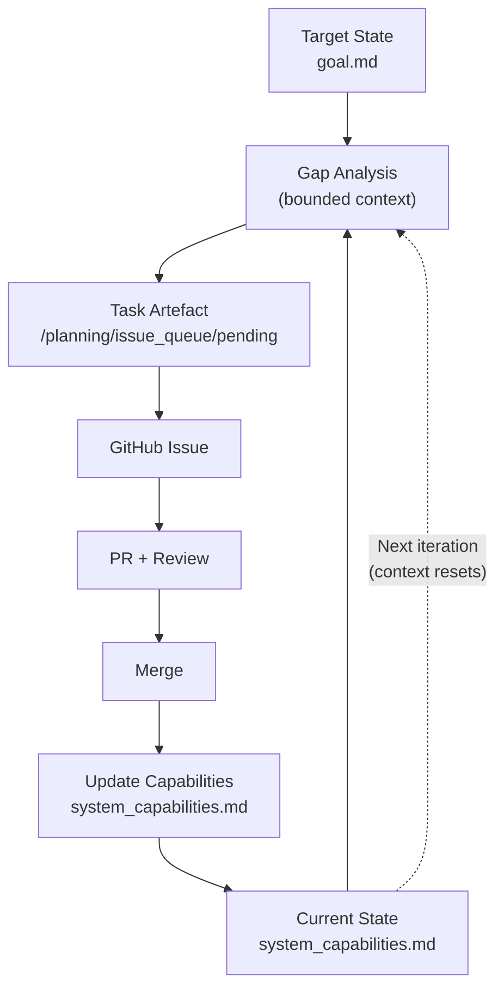

# GitHub Agent Orchestrator

[](https://github.com/trickl/github-agent-orchestrator/actions)
[](https://github.com/trickl/github-agent-orchestrator/actions)
[](https://www.python.org/downloads/)
[](https://opensource.org/licenses/MIT)

A Git-native **control loop for long-horizon, AI-assisted software development**, built around
**bounded context**, **explicit state**, and **Copilot-only cognition**.

This project is intentionally **not** a monolithic agent and does **not** rely on growing conversational context.
Instead, all planning, execution, and reflection are driven by **Git-tracked artefacts** and executed entirely via
**GitHub Copilot**.

---

## Why this exists

Most agent systems follow a familiar pattern:

> Keep adding requests and responses to a growing context window and ask the model what to do next.

This approach does not scale:

- Context grows without bound
- Costs increase over time
- Summarisation becomes necessary
- Detail is lost
- State becomes implicit and hallucinated
- Long-running tasks drift or collapse

**GitHub Agent Orchestrator enforces a different invariant:**

> **The LLM context is always bounded.**

All long-term state lives in the repository.
Each iteration operates over a fixed, minimal context derived from explicit files, not accumulated conversation.

This is a **development control loop** for building out applications and services not a chat loop. 
The goal is stable, unsupervised productive development over a period of up to 12 hours.
This unlocks significant producitvity gains as it can be run **overnight** and **while at work**.

---

## Core insight: bounded context + repo-derived control

This system is built on two principles:

1. **Bounded context**
   Each iteration runs with a fixed, small prompt. There is no accumulated history and no summarisation.

2. **Repo-derived control**
   All planning decisions are materialised as Git-tracked artefacts and executed via **GitHub Copilot**.
   No other model is required for planning, prioritisation, or reflection.

### Traditional agent systems vs this system

| | Traditional agents | GitHub Agent Orchestrator |
|---|---|---|
| Context | Grows over time | Fixed per iteration |
| Memory | Prompt history | Git-tracked files |
| Planning | Implicit, conversational | Explicit, artefact-driven |
| Models | Multiple / ad hoc | Copilot only |
| State | Hallucinated | Versioned |
| Auditability | Low | High |
| Cost profile | Increases | Stable |

---

## Mental model

- **Github Copilot**: does all reasoning and software development
- **GitHub Target Repository**: comtains code plus orchestration state
- **The orchestrator script**: oversees and manages the control loop (stateless)

Concretely:

- Issues = **intent**
- PRs = **execution**
- Reviews = **reflection**
- Orchestrator Repository files = **memory**


---

## The main control loop

The system continuously iterates over two explicit states:

- **Target state**: `/planning/vision/goal.md`
- **Current state**: `/planning/state/system_capabilities.md`

Each loop:

1. Compare target vs current
2. Identify a single concrete gap
3. Produce one task artefact
4. Execute it via Copilot (issue → PR)
5. Update the current state upon completion
6. Repeat

There is **no growing prompt comtext**.

### Control-loop diagram



---

## Canonical artefacts

The entire loop is driven by a small, explicit set of Git-tracked artefacts:

```text
/planning
    /vision
        goal.md
    /state
        system_capabilities.md
    /reviews
        review-YYYY-MM-DD.md
    /issue_queue
        pending/
        processed/
        complete/
```

The `/planning/issue_queue` directory is the handoff boundary between Copilot’s reasoning and the orchestrator’s
control.

---

## Canonical task types

These are never mixed.

### 1. Gap analysis

- Compares goal vs capabilities
- Produces exactly one task artefact
- No code changes

### 2. Development task

- Implements one concrete change
- Updates `system_capabilities.md`

### 3. Review task

- Critique only (architecture, complexity, coverage, etc.)
- Produces a review artefact

### 4. Review consumption

- Translates critique into candidate tasks
- No execution

---

## Features

- Minimal CLI for driving the loop
- Repo-derived loop state (no database, no local state)
- Copilot-only planning and execution
- Structured JSON logs (used by the dashboard and API)
- Optional REST server and UI dashboard for observability

---

## User role

The user owns exactly one artefact:

```text
/planning/vision/goal.md
```

Everything else is derived.

---

## Quick start

### Installation

```bash
pip install github-agent-orchestrator
```

For development:

```bash
git clone https://github.com/trickl/github-agent-orchestrator.git
cd github-agent-orchestrator
pip install -e ".[dev]"
```

### Configuration

```bash
ORCHESTRATOR_GITHUB_TOKEN=ghp_...
COPILOT_ASSIGNEE=copilot-swe-agent[bot]
LOG_LEVEL=INFO
```

---

## REST server and dashboard (optional)

```bash
orchestrator-server
```

- OpenAPI: http://127.0.0.1:8000/api/openapi.json
- Swagger UI: http://127.0.0.1:8000/api/docs

The dashboard is observational only; it does not alter system behaviour.

---

## Current status

- Artefact-driven development control loop
- Bounded-context execution
- Copilot-only planning and implementation
- Repo-derived state (no database)
- Optional dashboard and REST API
- Comprehensive tests

---

## To do

- Periodic automated review cycles (e.g. complexity, test coverage, visual QA)
- Improved error handling and recovery

---

## License

MIT License — see LICENSE.
npm run dev
