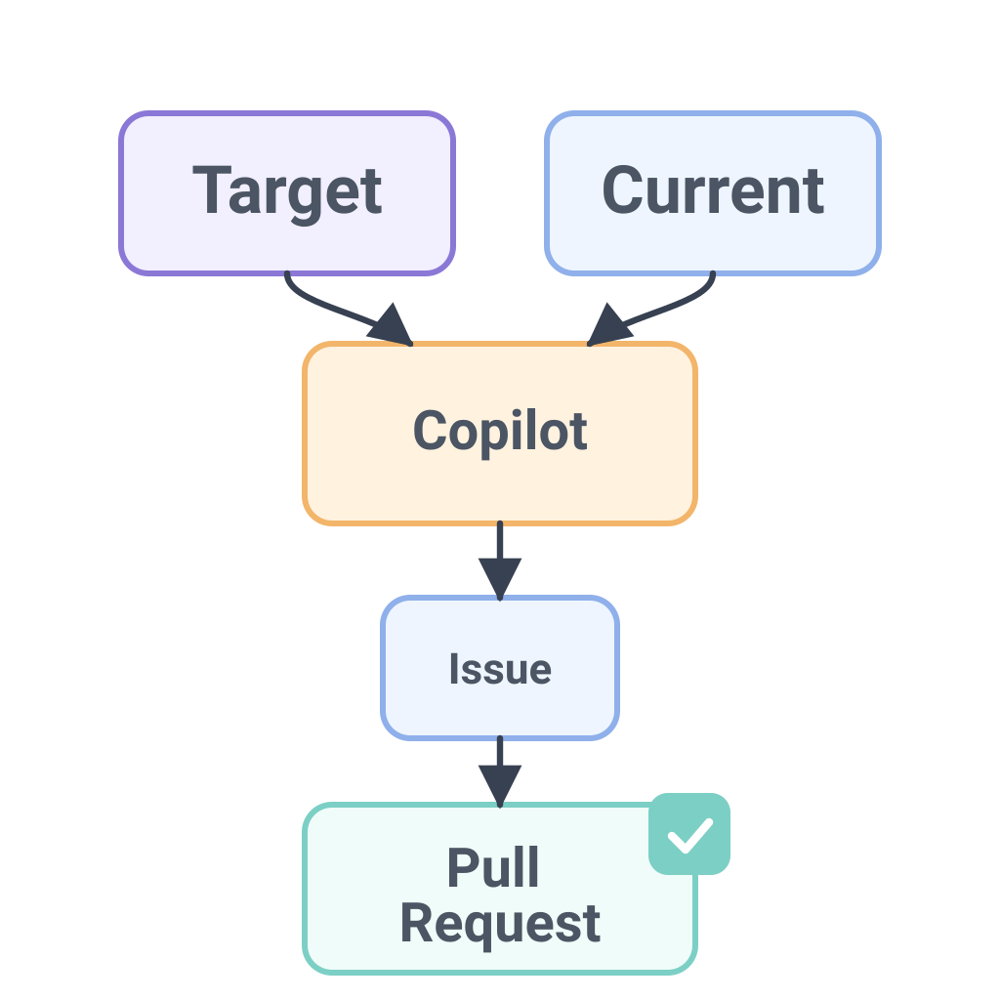
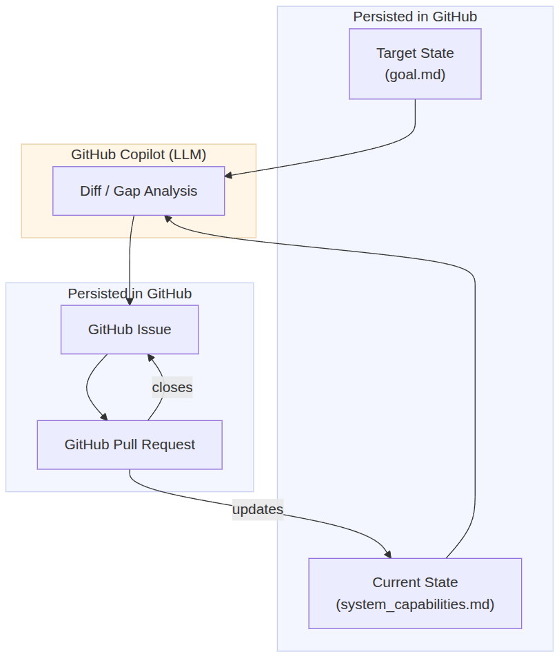

# GitHub Agent Orchestrator


[](https://www.python.org/downloads/)
[](https://opensource.org/licenses/MIT)

A Git-native **control loop for long-horizon, AI-assisted software development**, built around
**bounded context**, **explicit state**, and **Copilot-only cognition**.

This project is intentionally **not** a monolithic agent and does **not** rely on growing conversational context.
Instead, all planning, execution, and reflection are driven by **Git-tracked artefacts** and executed entirely via
**GitHub Copilot**.

---

## Why this exists

Most agent systems follow a familiar pattern:

> Keep adding requests and responses to a growing context window and ask the model what to do next.

This approach does not scale:

- Context grows without bound
- Costs increase over time
- Summarisation becomes necessary
- Detail is lost
- State becomes implicit and hallucinated
- Long-running tasks drift or collapse

**GitHub Agent Orchestrator enforces a different invariant:**

> **The LLM context is always bounded.**

All long-term state lives in the repository.
Each iteration operates over a fixed, minimal context derived from explicit files, not accumulated conversation.

This is a **development control loop** for building out applications and services not a chat loop. 
The goal is stable, unsupervised productive development over a period of up to 12 hours.
This unlocks significant producitvity gains as it can be run **overnight** and **while at work**.

---

## Quick Q&A

### Is this the same as the [Ralph Wiggum loop](https://github.com/vercel/ai/tree/main/examples/ralph-wiggum-loop)?

Short answer: **similar spirit, different mechanism.**

Both are designed for long-horizon, iterative development using AI.

The Ralph Wiggum loop works from a predefined list of requirements and iterates through them.

GitHub Agent Orchestrator instead behaves more like **gradient descent**:

- It computes the difference between **Target State** and **Current State**
- It derives the next Issue from that difference
- It updates the Current State after merge
- It recomputes the next step from the new delta

There is no fixed canonical task list.  
Work emerges from the gap.

---

### What do I need to run this?

- A Python environment  
- A GitHub account  

That’s it.

---

## Mental model

- **Github Copilot**: does all reasoning and software development
- **GitHub Target Repository**: comtains code plus orchestration state
- **The orchestrator script**: oversees and manages the control loop (stateless)

Concretely:

- Issues = **intent**
- PRs = **execution**
- Reviews = **reflection**
- Orchestrator Repository files = **memory**



---

## The main control loop

The system continuously iterates over two explicit states:

- **Target state**: `/.orchestrator-agent/state/target_state.md`
- **Current state**: `/.agent-orchestrator/state/current_state.md`

Each loop:

1. Compare target vs current
2. Identify a single concrete gap
3. Produce one task artefact
4. Execute it via Copilot (issue → PR)
5. Update the current state upon completion
6. Repeat

There is **no growing prompt comtext**.

## Canonical artefacts

The entire loop is driven by a small, explicit set of Git-tracked artefacts:

```text
/.agent-orchestrator
    /state
        target_state.md
        current_state.md
    /reviews
        review-YYYY-MM-DD.md
    /issue_queue
        pending/
        processed/
        complete/
```

The `/.agent-orchestrator/issue_queue` directory is the handoff boundary between Copilot’s reasoning and the orchestrator’s
control.

---

## Canonical task types

These are never mixed.

### 1. Gap analysis

- Compares target vs current
- Produces exactly one task artefact
- No code changes

### 2. Development task

- Implements one concrete change
- Updates `current_state.md` when a capability refresh is requested

### 3. Review task

- Critique only (architecture, complexity, coverage, etc.)
- Produces a review artefact

### 4. Review consumption

- Translates critique into candidate tasks
- No execution

---

## Features

- Minimal CLI for driving the loop
- Repo-derived loop state (no database, no local state)
- Copilot-only planning and execution
- Structured JSON logs (used by the dashboard and API)
- Optional REST server and UI dashboard for observability

## Running checks locally (recommended)

This repository does **not** run GitHub Actions by default.

After making changes, run the local verification script:

- `./scripts/verify-ci.sh`

It runs linting, formatting checks, type checking, and tests.

---

## User role

The user owns two artefacts:

```text
/.orchestrator-agent/state/target_state.md
```

Everything else is derived.

---

## Quick start

### CLI-first quickstart

```bash
orchestrator init --repo owner/repo
orchestrator auth github --token ghp_...
orchestrator run --repo owner/repo
```

Mode-driven package runner (defaults to `semi` mode):

```bash
gao run
```

Optional repo override:

```bash
gao run --repo owner/repo
```

For ongoing operation:

```bash
orchestrator status --repo owner/repo --pretty
orchestrator run --repo owner/repo
orchestrator cost --pretty
```

### Installation

```bash
pip install github-agent-orchestrator
```

For development:

```bash
git clone https://github.com/trickl/github-agent-orchestrator.git
cd github-agent-orchestrator
pip install -e ".[dev]"
```

### Configuration

```bash
ORCHESTRATOR_GITHUB_TOKEN=ghp_...
COPILOT_ASSIGNEE=copilot-swe-agent[bot]
LOG_LEVEL=INFO
ORCHESTRATOR_LOOP_MODE=build  # or: review
ORCHESTRATOR_TARGET_BASE_BRANCH=  # optional explicit base branch
ORCHESTRATOR_CREATE_WORK_BRANCH=true  # create per-issue work branches (safer default)
ORCHESTRATOR_WORK_BRANCH_PREFIX=orchestrator/work
```

Mode file in repo root (`.orchestrator.yml`):

```yaml
mode: semi
```

Supported values are `manual`, `semi` (default), and `auto`.

---

## REST server and dashboard (optional)

```bash
orchestrator-server
```

To run the same loop in **review mode** (review-intake → work → review-actions update):

```bash
orchestrator-server --loop-mode review
```

In review mode:

- Step 1 consumes the next review file under `.agent-orchestrator/reviews/review-*.md` and produces exactly one queue artefact.
- Step 2 executes queued work (both `review-*.md` and `dev-*.md` artefacts are eligible).
- Step 3 creates an “Update Review” issue that updates `.agent-orchestrator/reviews/review-YYYY-MM-DD.actions.md` with what was resolved.
- Review mode does **not** create “Update Capability” issues (i.e., it does not update `.agent-orchestrator/state/current_state.md`).

- OpenAPI: http://127.0.0.1:8000/api/openapi.json
- Swagger UI: http://127.0.0.1:8000/api/docs

### Lightweight local control-plane backend (pre-GitHub-App phase)

For pre-GitHub-App validation, this repository includes a minimal FastAPI control-plane
under `backend/app` that talks to **real GitHub repositories** using a **PAT**, while
executing orchestration **locally**.

Run locally:

```bash
uvicorn backend.app.main:app --reload --port 8000
```

Required environment variables:

- `GITHUB_TOKEN` (PAT used for backend GitHub API calls)
- `GITHUB_API_URL` (optional, defaults to `https://api.github.com`)
- `CORS_ORIGINS` (optional, comma-separated; include your GitHub Pages URL and local dev origin)
- `GITHUB_WEBHOOK_SECRET` (required for `POST /webhooks/github` signature verification)
- `GAO_CLI_COMMAND` (optional, defaults to `gao`)
- `GAO_RUN_TIMEOUT_SECONDS` (optional, defaults to `1800`)

MVP endpoints:

- `GET /repos`
- `GET /version`
- `POST /repos/{owner}/{repo}/target-state`
- `POST /repos/{owner}/{repo}/run`
- `GET /repos/{owner}/{repo}/status`
- `GET /repos/{owner}/{repo}/development-prs`
- `POST /webhooks/github`
- `GET /webhooks/events/recent`

`POST /repos/{owner}/{repo}/run` executes:

`gao run --repo owner/repo`

locally on the backend host and returns `stdout`, `stderr`, and `exit_code`.

This phase intentionally does **not** require GitHub App installation flow and does
**not** require local repository cloning.

`GET /repos/{owner}/{repo}/status` includes `hasTargetState` so the UI can switch
between first-time onboarding and the main control panel.

`POST /webhooks/github` currently provides deterministic summaries for:

- `workflow_run`
- `installation_repositories`
- `installation`
- `ping`

All other events are acknowledged and returned as `handled.kind: "unhandled"`.

`GET /webhooks/events/recent` returns an in-memory ring buffer of the latest accepted
webhook deliveries (most-recent-first), useful for local debugging.

`GET /version` returns deploy verification metadata:

- `version` (backend semantic version)
- `gitSha` (from `RENDER_GIT_COMMIT`, `GIT_COMMIT_SHA`, or `SOURCE_VERSION`)
- `buildTimeUtc` (from `BUILD_TIME_UTC` when set; otherwise runtime timestamp)

Use this endpoint after Render auto-deploys to confirm the exact backend revision now serving traffic.

### Automated versioning (main branch)

This repository includes automatic patch versioning on `main` via:

- `.github/workflows/version-bump.yml`
- `scripts/bump_version.py`

On each non-bot push to `main`, the workflow:

1. Increments patch version (`x.y.z -> x.y.(z+1)`) in:
    - `pyproject.toml`
    - `src/github_agent_orchestrator/__init__.py`
2. Commits the change
3. Creates and pushes a `v<version>` git tag

After deployment, call `GET /version` to confirm both semantic version and commit SHA served live.

The dashboard is observational only; it does not alter system behaviour.

### UI deployment (GitHub Pages) and API connectivity

The UI is configured to support two modes automatically:

- **Local development** (`npm run dev` in `ui/`):
    - Uses Vite dev proxy `/api -> http://127.0.0.1:8000`
    - This means local UI traffic targets a localhost backend service.
- **GitHub Pages deployment**:
    - Workflow: `.github/workflows/ui-pages.yml`
    - Build-time API base URL is set to:
        - `https://github-agent-orchestrator.onrender.com`

If you see browser-side `Failed to fetch`, ensure backend CORS allows the UI origin.
Default backend CORS origins are:

- `https://trickl.github.io`
- `http://localhost:5173`
- `http://127.0.0.1:5173`

Override via `CORS_ORIGINS` (comma-separated) in your deployment environment.

The Pages workflow also configures the correct Vite base path for repository-hosted pages
(`/<repo-name>/`) during CI builds.

---

## Current status

- Artefact-driven development control loop
- Bounded-context execution
- Copilot-only planning and implementation
- Repo-derived state (no database)
- Optional dashboard and REST API
- Comprehensive tests

---

## To do

- Periodic automated review cycles (e.g. complexity, test coverage, visual QA)
- Improved error handling and recovery

---

## License

MIT License — see LICENSE.
npm run dev
