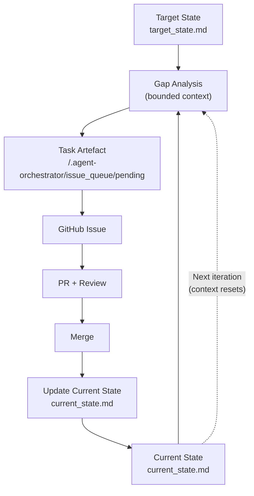

# GitHub Agent Orchestrator
[](https://www.python.org/downloads/)
[](https://opensource.org/licenses/MIT)


A Git-native **control loop for long-horizon, AI-assisted software development**, built around
**bounded context**, **explicit state**, and **Copilot-only cognition**.

This project is intentionally **not** a monolithic agent and does **not** rely on growing conversational context.
Instead, all planning, execution, and reflection are driven by **Git-tracked artefacts** and executed entirely via
**GitHub Copilot**.

---

## Why this exists

Most agent systems follow a familiar pattern:

> Keep adding requests and responses to a growing context window and ask the model what to do next.

This approach does not scale:

- Context grows without bound
- Costs increase over time
- Summarisation becomes necessary
- Detail is lost
- State becomes implicit and hallucinated
- Long-running tasks drift or collapse

**GitHub Agent Orchestrator enforces a different invariant:**

> **The LLM context is always bounded.**

All long-term state lives in the repository.
Each iteration operates over a fixed, minimal context derived from explicit files, not accumulated conversation.

This is a **development control loop** for building out applications and services not a chat loop. 
The goal is stable, unsupervised productive development over a period of up to 12 hours.
This unlocks significant producitvity gains as it can be run **overnight** and **while at work**.

---

## Core insight: bounded context + repo-derived control

This system is built on two principles:

1. **Bounded context**
   Each iteration runs with a fixed, small prompt. There is no accumulated history and no summarisation.

2. **Repo-derived control**
   All planning decisions are materialised as Git-tracked artefacts and executed via **GitHub Copilot**.
   No other model is required for planning, prioritisation, or reflection.

### Traditional agent systems vs this system

| | Traditional agents | GitHub Agent Orchestrator |
|---|---|---|
| Context | Grows over time | Fixed per iteration |
| Memory | Prompt history | Git-tracked files |
| Planning | Implicit, conversational | Explicit, artefact-driven |
| Models | Multiple / ad hoc | Copilot only |
| State | Hallucinated | Versioned |
| Auditability | Low | High |
| Cost profile | Increases | Stable |

---

## Mental model


- **Github Copilot**: does all reasoning and software development
- **GitHub Target Repository**: comtains code plus orchestration state
- **The orchestrator script**: oversees and manages the control loop (stateless)

Concretely:

- Issues = **intent**
- PRs = **execution**
- Reviews = **reflection**
- Orchestrator Repository files = **memory**


---

## The main control loop

The system continuously iterates over two explicit states:

- **Target state**: `/.agent-orchestrator/state/target_state.md`
- **Current state**: `/.agent-orchestrator/state/current_state.md`

Each loop:

1. Compare target vs current
2. Identify a single concrete gap
3. Produce one task artefact
4. Execute it via Copilot (issue → PR)
5. Update the current state upon completion
6. Repeat

There is **no growing prompt comtext**.

### Control-loop diagram


```mermaid
flowchart TD
    Target["Target State<br/>target_state.md"]
    Cap["Current State<br/>current_state.md"]

    Gap["Gap Analysis<br/>(bounded context)"]

    Queue["Task Artefact<br/>/.agent-orchestrator/issue_queue/pending"]
    Issue["GitHub Issue"]
    PR["PR + Review"]
    Merge["Merge"]

    Update["Update Current State<br/>current_state.md"]

    Target --> Gap
    Cap --> Gap
    Gap --> Queue
    Queue --> Issue
    Issue --> PR
    PR --> Merge
    Merge --> Update
    Update --> Cap

    Cap -.->|"Next iteration<br/>(context resets)"| Gap
```

---

## Canonical artefacts

The entire loop is driven by a small, explicit set of Git-tracked artefacts:

```text
/.agent-orchestrator
    /state
        target_state.md
        current_state.md
    /reviews
        review-YYYY-MM-DD.md
    /issue_queue
        pending/
        processed/
        complete/
```

The `/.agent-orchestrator/issue_queue` directory is the handoff boundary between Copilot’s reasoning and the orchestrator’s
control.

---

## Canonical task types

These are never mixed.

### 1. Gap analysis

- Compares target vs current
- Produces exactly one task artefact
- No code changes

### 2. Development task

- Implements one concrete change
- Updates `current_state.md` when a capability refresh is requested

### 3. Review task

- Critique only (architecture, complexity, coverage, etc.)
- Produces a review artefact

### 4. Review consumption

- Translates critique into candidate tasks
- No execution

---

## Features

- Minimal CLI for driving the loop
- Repo-derived loop state (no database, no local state)
- Copilot-only planning and execution
- Structured JSON logs (used by the dashboard and API)
- Optional REST server and UI dashboard for observability

## Running checks locally (recommended)

This repository does **not** run GitHub Actions by default.

After making changes, run the local verification script:

- `./scripts/verify-ci.sh`

It runs linting, formatting checks, type checking, and tests.

---

## User role

The user owns two artefacts:

```text
/.agent-orchestrator/state/target_state.md
```

Everything else is derived.

---

## Quick start

### CLI-first quickstart

```bash
orchestrator init --repo owner/repo
orchestrator auth github --token ghp_...
orchestrator run --repo owner/repo
```

For ongoing operation:

```bash
orchestrator status --repo owner/repo --pretty
orchestrator run --repo owner/repo
orchestrator cost --pretty
```

### Installation

```bash
pip install github-agent-orchestrator
```

For development:

```bash
git clone https://github.com/trickl/github-agent-orchestrator.git
cd github-agent-orchestrator
pip install -e ".[dev]"
```

### Configuration

```bash
ORCHESTRATOR_GITHUB_TOKEN=ghp_...
COPILOT_ASSIGNEE=copilot-swe-agent[bot]
LOG_LEVEL=INFO
ORCHESTRATOR_LOOP_MODE=build  # or: review
ORCHESTRATOR_TARGET_BASE_BRANCH=  # optional explicit base branch
ORCHESTRATOR_CREATE_WORK_BRANCH=true  # create per-issue work branches (safer default)
ORCHESTRATOR_WORK_BRANCH_PREFIX=orchestrator/work
```

---

## REST server and dashboard (optional)

```bash
orchestrator-server
```

To run the same loop in **review mode** (review-intake → work → review-actions update):

```bash
orchestrator-server --loop-mode review
```

In review mode:

- Step 1 consumes the next review file under `.agent-orchestrator/reviews/review-*.md` and produces exactly one queue artefact.
- Step 2 executes queued work (both `review-*.md` and `dev-*.md` artefacts are eligible).
- Step 3 creates an “Update Review” issue that updates `.agent-orchestrator/reviews/review-YYYY-MM-DD.actions.md` with what was resolved.
- Review mode does **not** create “Update Capability” issues (i.e., it does not update `.agent-orchestrator/state/current_state.md`).

- OpenAPI: http://127.0.0.1:8000/api/openapi.json
- Swagger UI: http://127.0.0.1:8000/api/docs

The dashboard is observational only; it does not alter system behaviour.

---

## Current status

- Artefact-driven development control loop
- Bounded-context execution
- Copilot-only planning and implementation
- Repo-derived state (no database)
- Optional dashboard and REST API
- Comprehensive tests

---

## To do

- Periodic automated review cycles (e.g. complexity, test coverage, visual QA)
- Improved error handling and recovery

---

## License

MIT License — see LICENSE.
npm run dev
